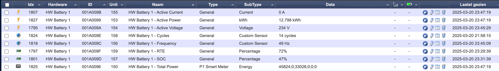

# HomeWizard-Battery-plugin
A Python plugin for Domoticz that creates several devices for the HomeWizard Battery.  

The plugin configuration requires the ip of the battery and a token.
The token is created on the battery using the `activate_user.py` script. 
The script initiates the token generation protocol as described in https://api-documentation.homewizard.com/docs/v2/authorization.
To run it provide the ip of the battery and an user name as an argument. 
It asks the user to press enter after the battery has been put in token generation mode, by pressing the button above the led array.
When a token is aquirred the script prints the token returned as well as device and user infornation.

Please provide comments via github.

